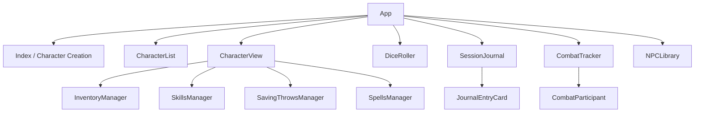

# Architecture

Digital TTRPG Companion - a React-based tabletop RPG character management app.

## Component Hierarchy



## Data Flow

```
┌─────────────────┐     ┌──────────────────┐     ┌────────────────┐
│   React State   │ ←→  │   localStorage   │ ←→  │   JSON Data    │
│   (useState)    │     │   Persistence    │     │   (strings)    │
└─────────────────┘     └──────────────────┘     └────────────────┘
```

**Storage Keys**:
- `soloquest_characters` - Character data
- `soloquest_npcs` - NPC library
- `soloquest_journal` - Session journal entries

## Layer Structure

| Layer | Path | Purpose |
|-------|------|---------|
| Pages | `/src/pages/` | Route-level components |
| Components | `/src/components/` | Reusable UI components |
| UI | `/src/components/ui/` | shadcn/ui primitives |
| Types | `/src/types/` | TypeScript interfaces |
| Data | `/src/data/` | D&D 5e game data (classes, spells, equipment) |
| Utils | `/src/utils/` | Helper functions |
| Hooks | `/src/hooks/` | Custom React hooks |

## Key Subsystems

### Character Management
- **Create**: Index page with CharacterWizard steps
- **View/Edit**: CharacterView with HP, inventory, skills, spells
- **List**: CharacterList with search/filter

### Combat Tracking
- Initiative order management
- HP tracking with sync to character data
- Condition tracking with duration

### Dice Rolling
- D4-D20 support with modifiers
- Advantage/disadvantage modes
- Roll history

### Session Journal
- Timestamped entries with tags
- Search and filter by tag type
